# Worksheets

The most efficient way to learn Snowflake is to see the product in action. So in this doc, we are going to upload a SQL worksheet and start querying data, but be aware there are other ways to interact with Snowflake. We could use Python worksheets or even Snowflake-native notebooks directly from the Snowflake web UI. For now, we'll stick with the SQL worksheet, which will give us a starting point for thinking about Snowflake. In a later stage, as we work through different parts of the Snowflake UI, we'll begin to see the bigger picture.

> [!Note]
> All the instructions and code you need to get started has already been provided in the resources folder, including instructions on how to set up your Snowflake account.

## Dataset: Tasty Bites

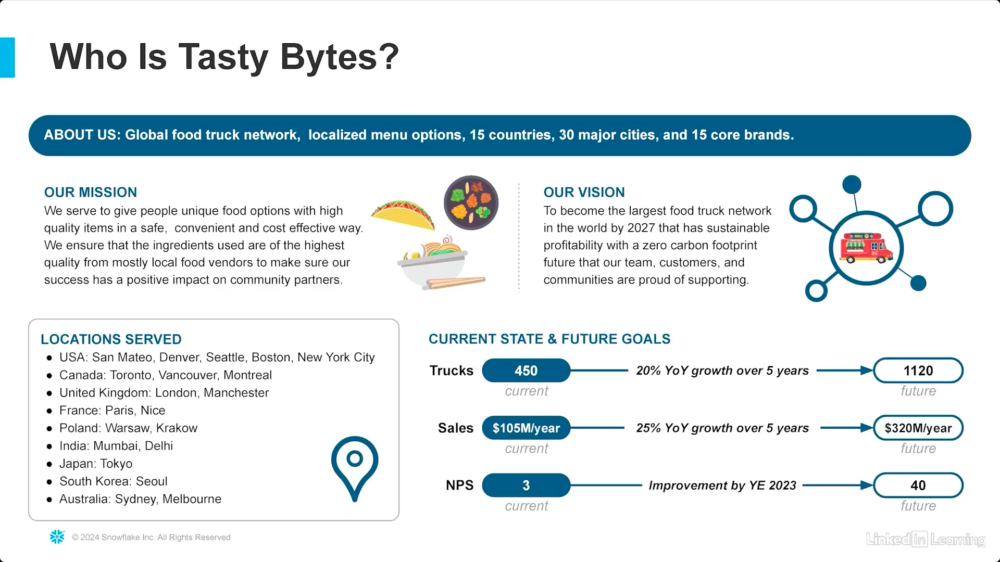

Our goal in this doc is to start using Snowflake to work with a really cool dataset Snowflake created about a fake food truck company called Tasty Bytes. This fictitious company runs 450 food trucks in many countries, India, Japan, France, Poland, and more, and it has huge growth ambitions. This dataset will be our main source of data throughout the course, so let's get an early taste of what's in it.

## Worksheets & a simple example: Part 1

1. What you're seeing now is the primary browser-based way of interacting with Snowflake. We call it Snowsight, and we'll do most of our work in Snowsight for this course. Under Projects on the left-hand side of the screen, I click on Worksheets.

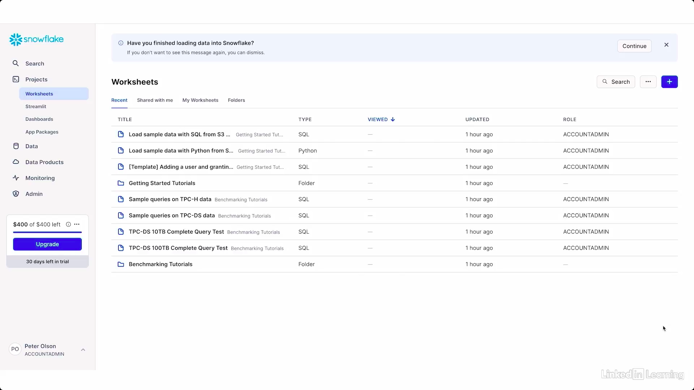

2. Under Projects on the left-hand side of the screen, I click on Worksheets. What we're looking at now are Snowflake worksheets. If you look at the Type column, you'll see some SQL ones and some Python ones, plus a folder or two, which will contain, you guessed it, more worksheets. It's basically worksheet heaven. 

3. I'm going to upload a worksheet called Worksheets and a Simple Example. I do this by clicking on the three dots on the right-hand side of the screen and selecting Create Worksheet from SQL File. Then I select my SQL file, and now, the fun starts.

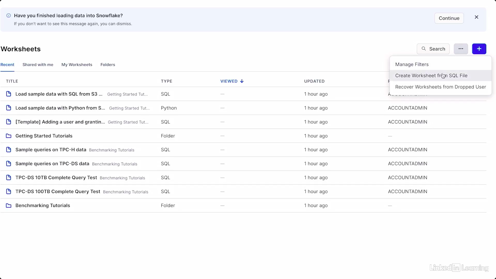

4. What we're looking at is a SQL worksheet. SQL worksheets lets you write and run SQL statements, explore and filter query results, and visualize the results. You can see at the top of this worksheet that there is grayed-out text. These are comments, and when you run the worksheet, these comments don't do anything. As is standard in SQL, there are two different ways of adding comments. 

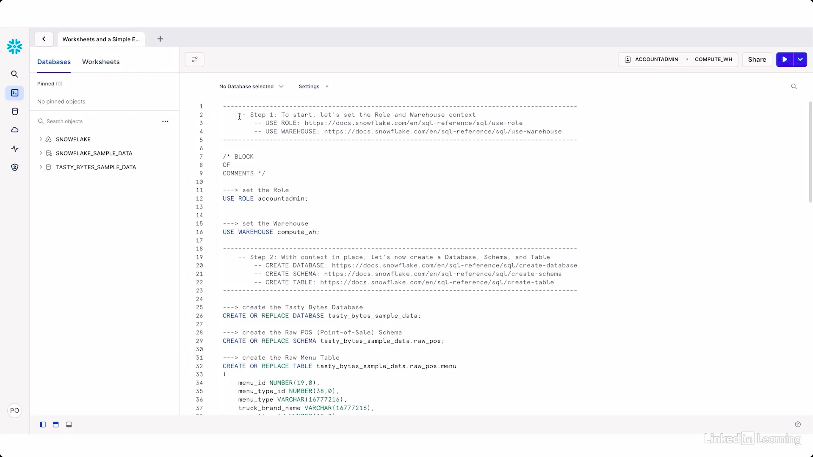

*Now we're going to do a few things in quick succession to get the data set up so we can query it. And don't worry, we'll cover everything we've done in more detail later. Right now, we're just doing a few things to get to the point where we have data we can query, and in our doc on stages and basic ingestion, we'll learn more about what we did to ingest data.*

5. So first we set the role. You do this by putting your cursor inside the block of code you want to run. Each block of code is separated by a semicolon, so just put your cursor somewhere before the semicolon, but after the previous semicolon. 

    - If you're on a Mac, hold Command + Return to run that block. 
    - If you're on a PC, hold Control + Enter. 

    You should see a status update on the bottom of the screen that the statement executed successfully.

Query:

```sql
USE ROLE accountadmin;
```

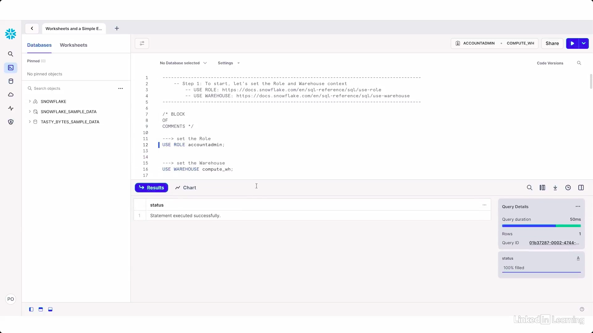

> [!NOTE]
> To see a list of the hotkeys you could use in a worksheet, you can hold Command + Shift + ?. Make sure to scroll down to see them all.

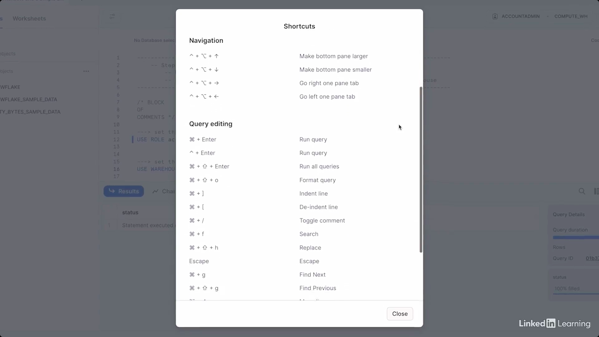

6. Now, I'll set the warehouse by putting my cursor anywhere in the USE WAREHOUSE line. Type Control + Enter. In the doc on virtual warehouses, we'll talk about why we did this and what effect it had, but for now, we're trying to get to the point where we can query some data as quickly as possible.

Query:

```sql
USE WAREHOUSE compute_wh;
```

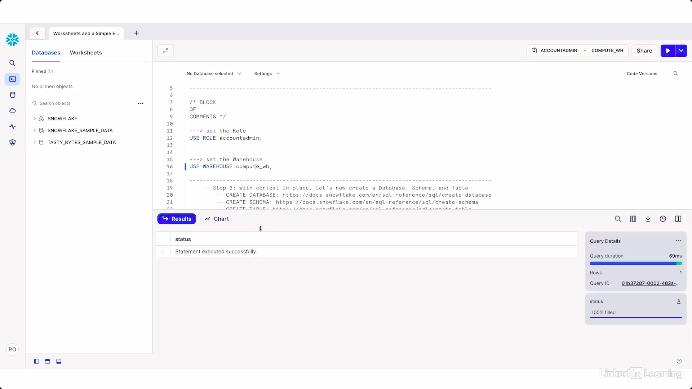

*Now I'm going to move a little faster. I'll use my cursor to highlight all of the code from steps two-to-four inclusive and I'll type Command + Enter to run all of that.*

7.  We just created a database, schema and table.

Query:

```sql
---> create the Tasty Bytes Database
CREATE OR REPLACE DATABASE tasty_bytes_sample_data;
---> create the Raw POS (Point-of-Sale) Schema
CREATE OR REPLACE SCHEMA tasty_bytes_sample_data.raw_pos;
---> create the Raw Menu Table
CREATE OR REPLACE TABLE tasty_bytes_sample_data.raw_pos.menu
(
    menu_id NUMBER(19,0),
    menu_type_id NUMBER(38,0),
    menu_type VARCHAR(16777216),
    truck_brand_name VARCHAR(16777216),
    menu_item_id NUMBER(38,0),
    menu_item_name VARCHAR(16777216),
    item_category VARCHAR(16777216),
    item_subcategory VARCHAR(16777216),
    cost_of_goods_usd NUMBER(38,4),
    sale_price_usd NUMBER(38,4),
    menu_item_health_metrics_obj VARIANT
);
```

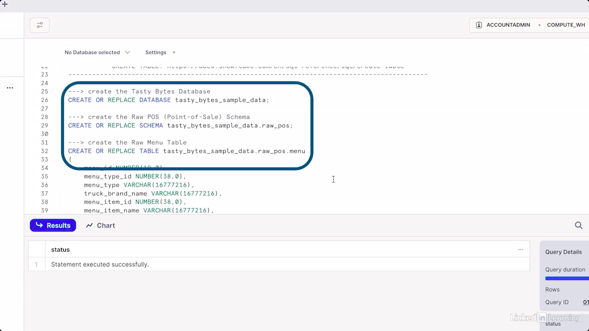

8. We just created a database, schema and table. We created a stage with data from S3.

```sql
---> create the Stage referencing the Blob location and CSV File Format
CREATE OR REPLACE STAGE tasty_bytes_sample_data.public.blob_stage
url = 's3://sfquickstarts/tastybytes/'
file_format = (type = csv);

---> query the Stage to find the Menu CSV file
LIST @tasty_bytes_sample_data.public.blob_stage/raw_pos/menu/;
```

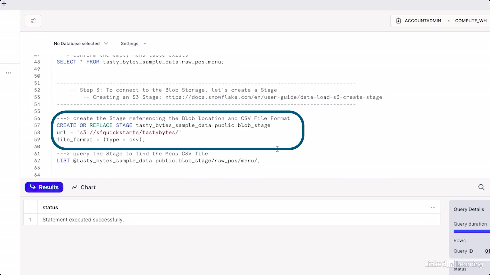

9. Finally, we copied data from that stage into our new table.

Query:

```sql
---> copy the Menu file into the Menu table
COPY INTO tasty_bytes_sample_data.raw_pos.menu
FROM @tasty_bytes_sample_data.public.blob_stage/raw_pos/menu/;
```

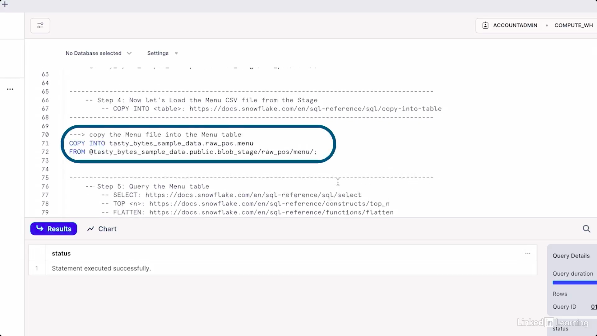

*Now comes the triumphant moment, the moment we've been building up to, querying one of our Tasty Bytes' food truck tables.*

10. Now let's run the next line of code to see how many rows are in our table.

Query:

```sql
SELECT COUNT(*) AS row_count FROM tasty_bytes_sample_data.raw_pos.menu;
```

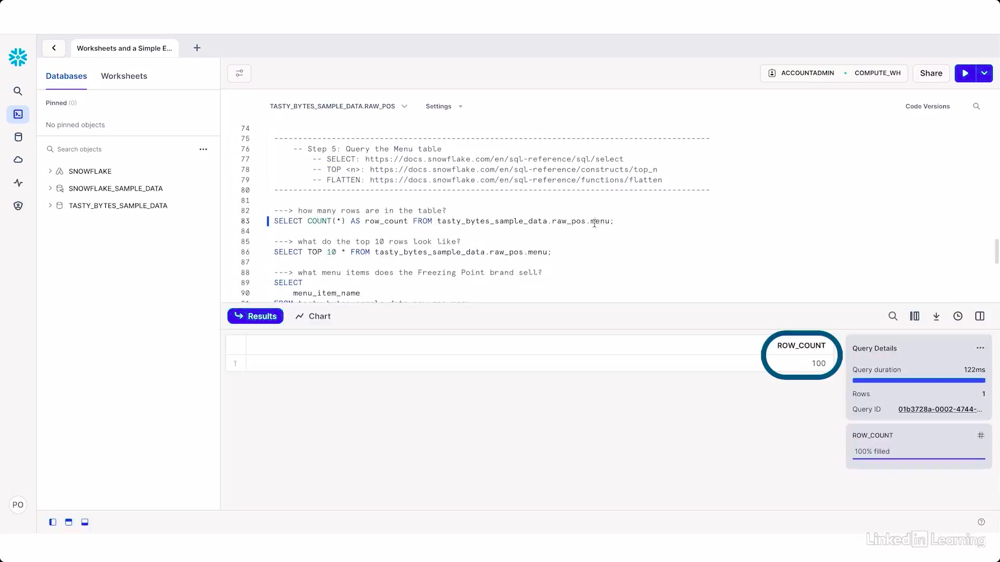

We just ran our first query. That's a big deal. In this doc, we learned about the fictional Tasty Bytes dataset, hopped into Snowsight, loaded a worksheet, and ran a query. Next, we'll pick up right where we left off and learn more about our data.

## Worksheets & a simple example: Part 2

Now, let's do more digging to see if we can find out more about what this menu is telling us. 

1. To do this, let's run the next line of code. The results pop up at the bottom and inspecting the data, I'm seeing different kinds of desserts and beverages offered by a particular food truck brand.

Query:

```sql
SELECT TOP 10 * FROM tasty_bytes_sample_data.raw_pos.menu;
```

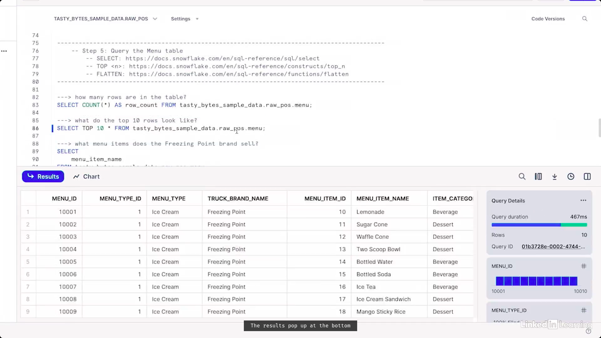

*Again, all of this Tasty Bytes data is fictitious. We generated this dataset at Snowflake. It looks like we have data on:*

- *How much the goods cost for a given food truck to provide.*
- *How much they're selling them for*
- *We have some ingredients and health information in a semi-structured data format.* 

*We'll talk more about semi-structured data later in the course.*

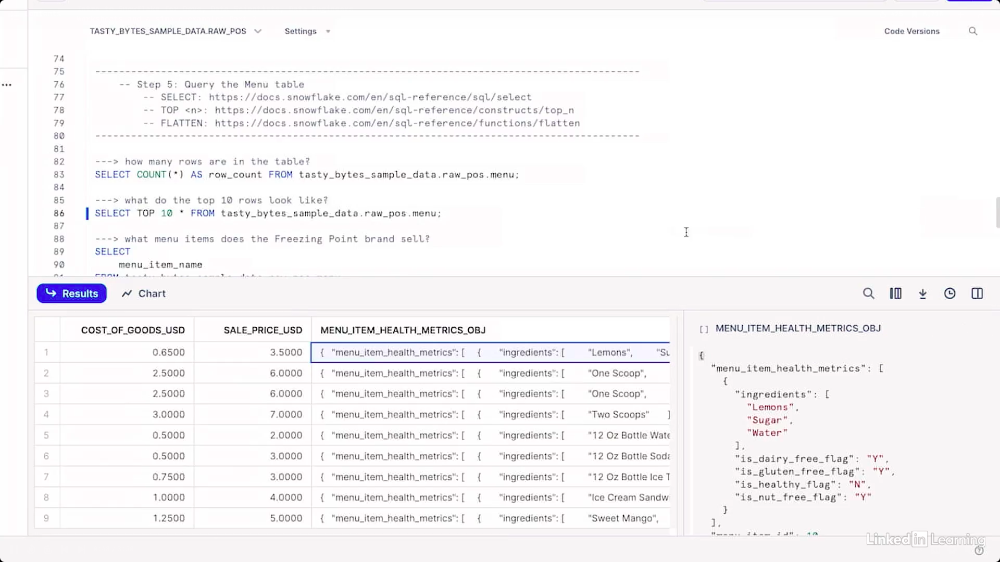

*Let's indulge and do a little more exploring because it feels like a shame to have done this work to get a cool data set in front of us without exploring it a bit.*

2. Let's just run some simple code. This isn't a course on SQL, but as a reminder: 

    - When we GROUP BY 1, it means group by the first column listed in the SELECT statement. So in this case, TRUCK_BRAND_NAME. 
    - When we ORDER BY 2 DESC, we're saying we want to order the results by the second column, the count from highest to lowest.

Query:

```sql
SELECT 
    TRUCK_BRAND_NAME, 
    COUNT(*) 
FROM tasty_bytes_sample_data.raw_pos.menu 
GROUP BY 1 
ORDER BY 2 DESC.
```

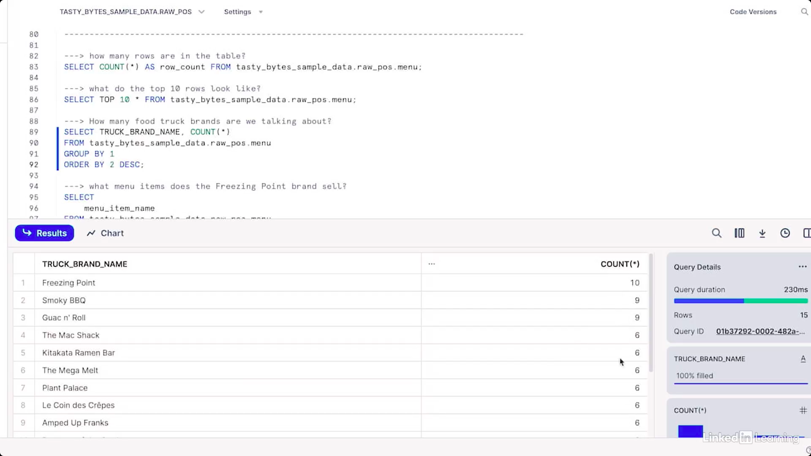

*What we see is there are 15 different food truck brands in this menu table, and they have between six and 10 menu items each.*

3. Now, when we did our first query, I saw that there was a field called MENU_TYPE. What's the relationship between the food truck's brand name and the menu type? Are there more menu types than food truck brands or fewer, or is there a one-to-one mapping? Let's check this out quickly. All we need to do is revise our query to add MENU_TYPE as another field to GROUP BY, and then we GROUP BY 1 and 2 and ORDER BY 3

Query:

```sql
SELECT 
    TRUCK_BRAND_NAME, 
    MENU_TYPE, 
    COUNT(*) 
FROM tasty_bytes_sample_data.raw_pos.menu 
GROUP BY 1, 2 
ORDER BY 3 DESC;
```

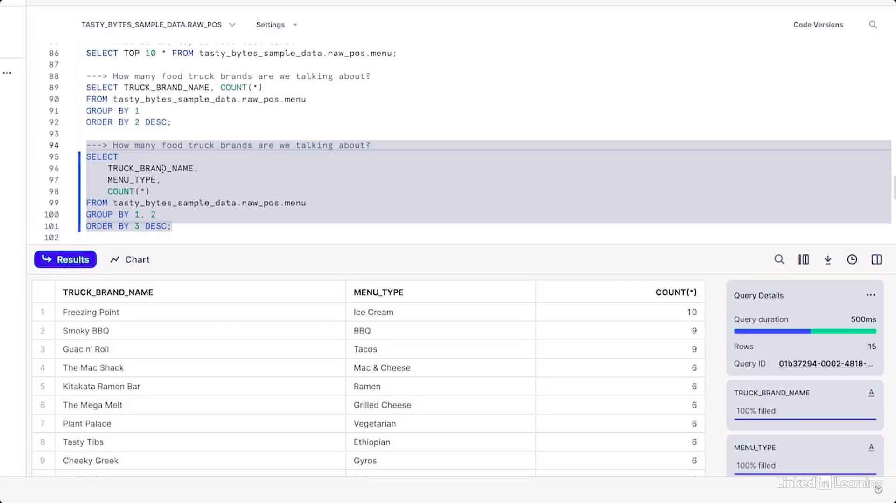

*We run this and see that it looks like there are still 15 rows, and each TRUCK_BRAND_NAME seems to correspond to a particular MENU_TYPE. So it appears that if you know the MENU_TYPE, you know the TRUCK_BRAND_NAME and vice versa.*

4. Okay, the last thing I wanted to show you is that you can always create more worksheets to keep your code organized. 

    - If you go to the top of the screen and click on a plus sign, you can make a new one. 
    
    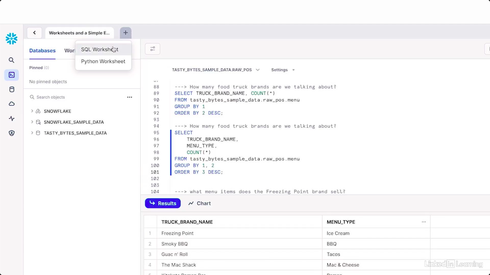

    - And if you copy over a line of code, you can run a query from that new worksheet. 

    Query:

    ```sql
    SELECT COUNT(*) AS row_count FROM tasty_bytes_sample_data.raw_pos.menu;
    ```

    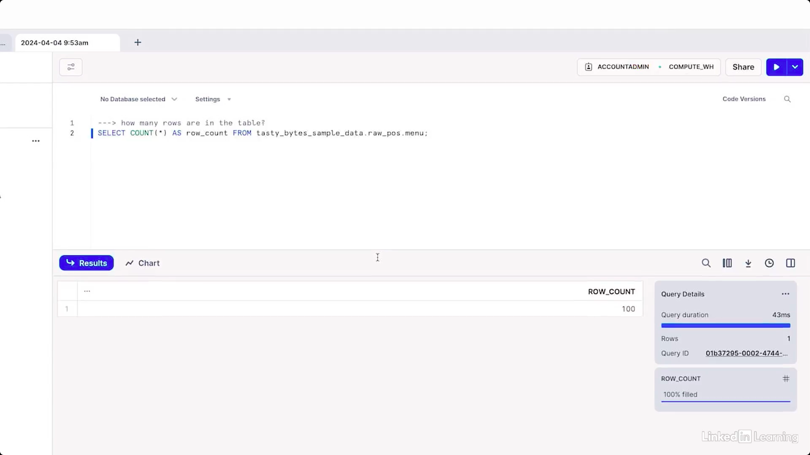
    
    - Or you can go back to the main Snowsight menu by clicking on the projects tab on the left side of the screen. Then, make sure you're in the Worksheets section and you can click the plus in the top right corner and hop into a new worksheet that way.

    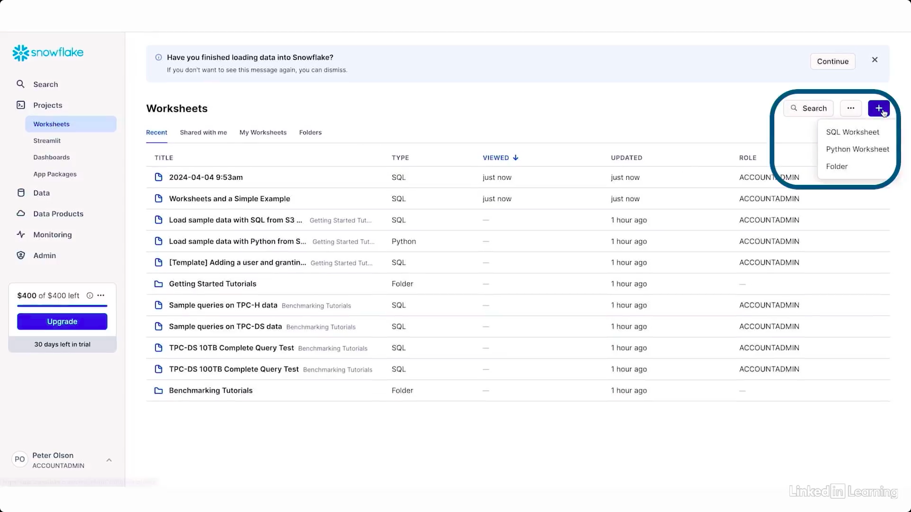

    - If you scroll to the top of your worksheet tab and click on the three vertical dots there, you can rename your worksheet to whatever you'd like.

    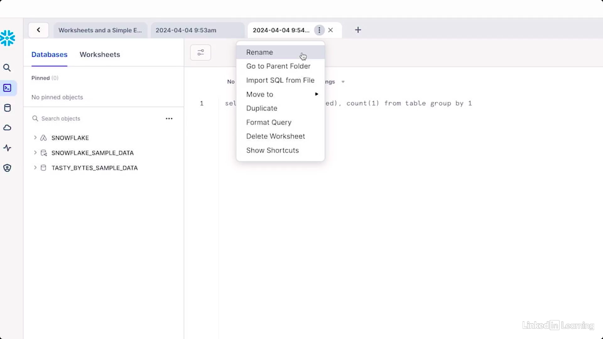


*So there you go, we learned about the fictional Tasty Bytes data set, hopped into Snowsight, loaded a worksheet, queried some data, and then learned how to create a new worksheet. Look at us, we've only just gotten started, but we've already come so far.*

---

<div align="center">

<h2>✦ Thank You For Reading This Guide ✦</h2>

> *May your pipelines never break and your queries always run fast.* 🚀

</div>