# Virtual Warehouses

So what is a virtual warehouse? The Snowflake docs define it as a cluster of compute resources in Snowflake. When I spin up a virtual warehouse, I think about the cluster I'm accessing from the Snowflake pool from AWS, GCP or Azure. In my mind's eye, I can see the machine and say the AWS Oregon West region, and I'm now in command of some CPU memory and temporary storage resources.

In this doc, we'll talk about what Use Warehouse does. We'll also learn how to create a virtual warehouse and how to list your existing warehouses.

> [!NOTE]
> You use a warehouse for a couple of things, executing most SQL queries and also for DML commands, data manipulation language commands that update the data in some way, like deleting or inserting rows or copying data into a table.

## Virtual Warehouses Overview

When you're working in Snowsight, again, that's Snowflake's browser-based UI, there are often two ways to do something. 

- You can click buttons in the UI itself 
- You can also write code inside a SQL or Python worksheet or other S site interfaces that accept code. 

Throughout this course, we'll often cover both the UI and the code-based ways of doing things. So let's first create a warehouse through the UI.

### Virtual Warehouse Using UI

1. If we go to the menu on the left hand side of the screen and click on the admin tab and then click on warehouses, we see that we already have a warehouse, Compute Warehouse, the one we used in the last doc.

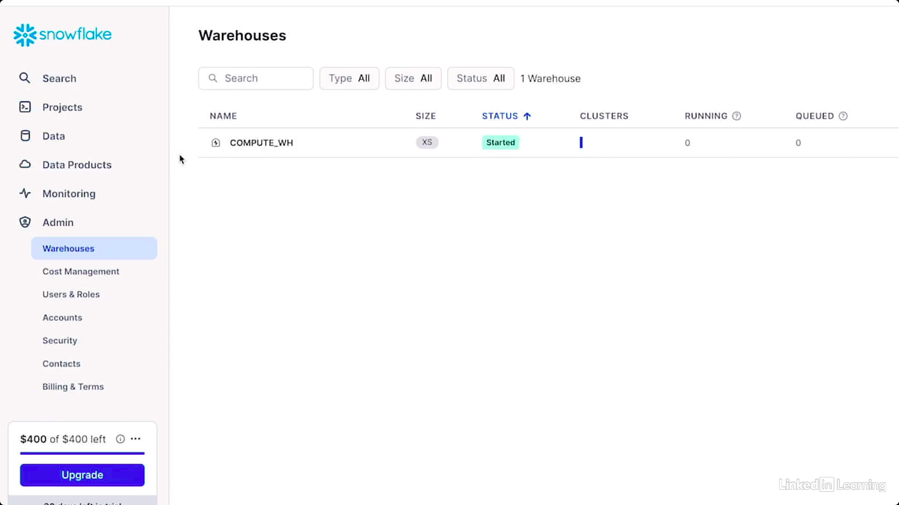

*This is the default warehouse that comes with the trial account*

2. let's give it a friend by clicking the plus warehouse button at the top right of the screen. Let's name it Warehouse Gilberto, since one of my fellow developer advocates is named Gilberto.

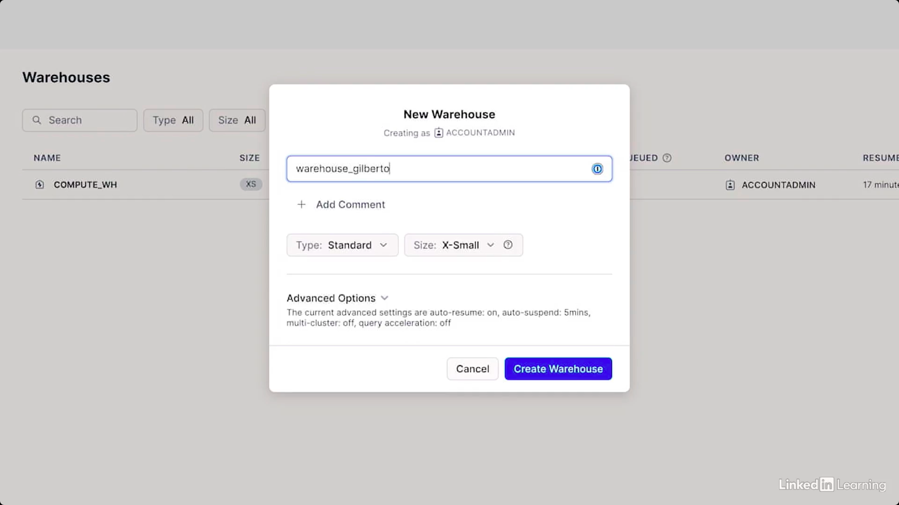

3. If we click on type, we can see that we have the option of making it Snowpark-optimized, which is a warehouse with extra memory. But for now, we'll stick with Standard.

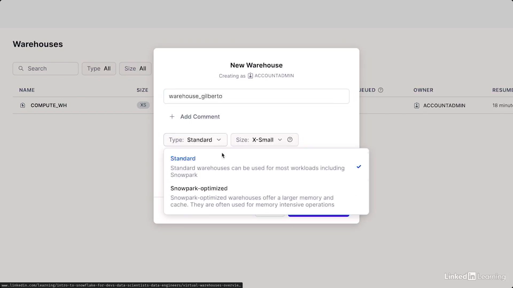

4. if we click on size, we can see that we could opt for higher or lower performing warehouses. For now, let's make this one slightly bigger than Compute Warehouse. So we'll make it small instead of extra small. 

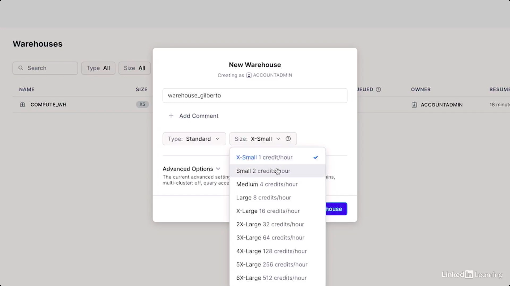

*we'll discuss later what using larger warehouses does for you and how to switch warehouse sizes even mid workflow. We'll ignore the advanced options for the moment and go ahead and create our virtual warehouse.*

> [!IMPORTANT]
> Although the term warehouse sounds like a place where you store things, in Snowflake the warehouses for compute, not storage. And just to define our terms, storage refers to where your data is stored and compute refers to where your queries are processed and usually requires data to move from storage into the compute nodes.

5. Now that we have a warehouse of our own, you can see that it automatically comes online as started. 

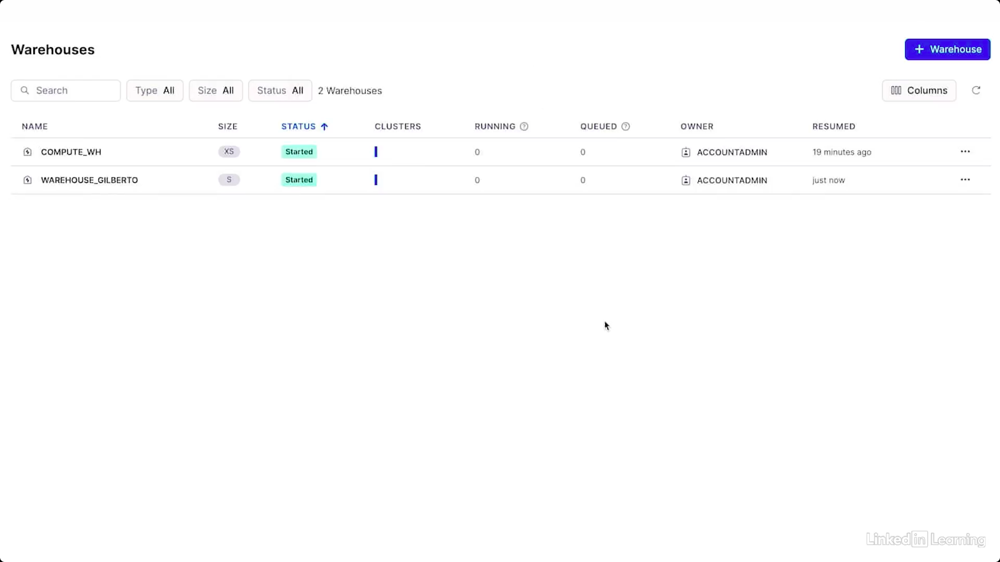


*This means there are real compute resources in Snowflake that you're controlling, and we're also getting build for it, which we'll discuss more later.*

6. If we click on it, we'll see that it's not doing anything yet. So let's change that.

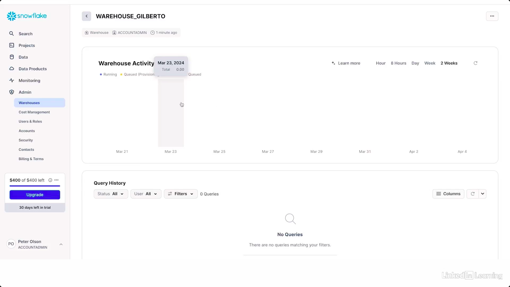

7. Let's hop back to our worksheets in a simple example worksheet and scroll down to our sample queries. If we look at the top right of the screen, we can see the warehouse currently associated with this worksheet, Compute Warehouse. So let's switch that to our new warehouse, Warehouse Gilberto.

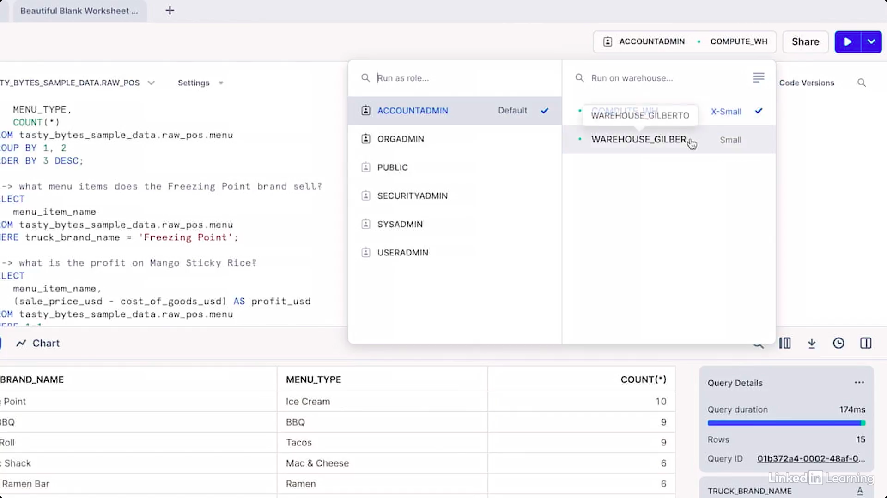

8. Check out the menu items for the Freezing Point brand, a food truck.

Query:

```sql
SELECT
    menu_item_name
FROM tasty_bytes_sample_data.raw_pos.menu
WHERE truck_brand_name = 'Freezing Point';
```

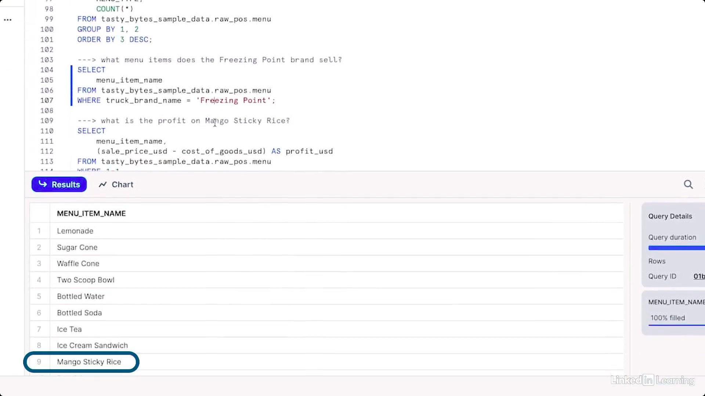

9. Of these, mango sticky rice sounds tastiest to me. So let's look at that one a bit more and see how much of a profit Freezing Point makes every time it sells a unit of mango sticky rice.


Query:

```sql
SELECT
    menu_item_name,
    (sale_price_usd - cost_of_goods_usd) AS profit_usd
FROM tasty_bytes_sample_data.raw_pos.menu
WHERE 1=1
AND truck_brand_name = 'Freezing Point'
AND menu_item_name = 'Mango Sticky Rice';
```

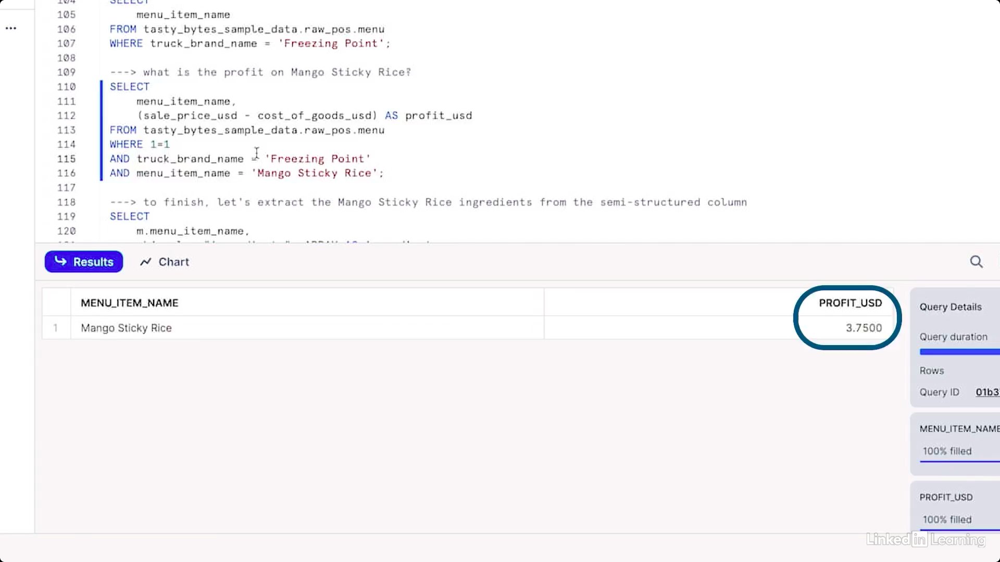

*So we run the query and see a profit of $3.75 cents. Not bad.*

> [!NOTE]
> So the warehouse we're using now is one that we created through the UI, but we can also create a warehouse using SQL commands. So let's do that.

### Virtual Warehouse Using SQL

1. We just type create warehouse, followed by the warehouse name. Let's call this one warehouse_dash. Dash is another one of my colleagues.

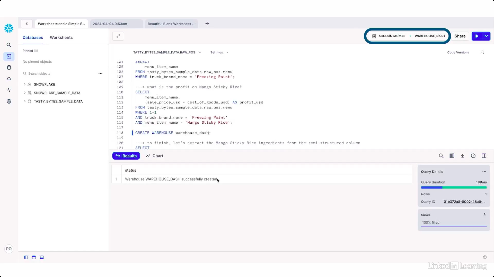

*Notice that when we created that warehouse, it switched the worksheet warehouse to use the new one.*

2. So let's take a look at all our warehouses at once by running the Show Warehouses command. The two new warehouses we've made are listed here.

Query:

```sql
SHOW WAREHOUSES;
```

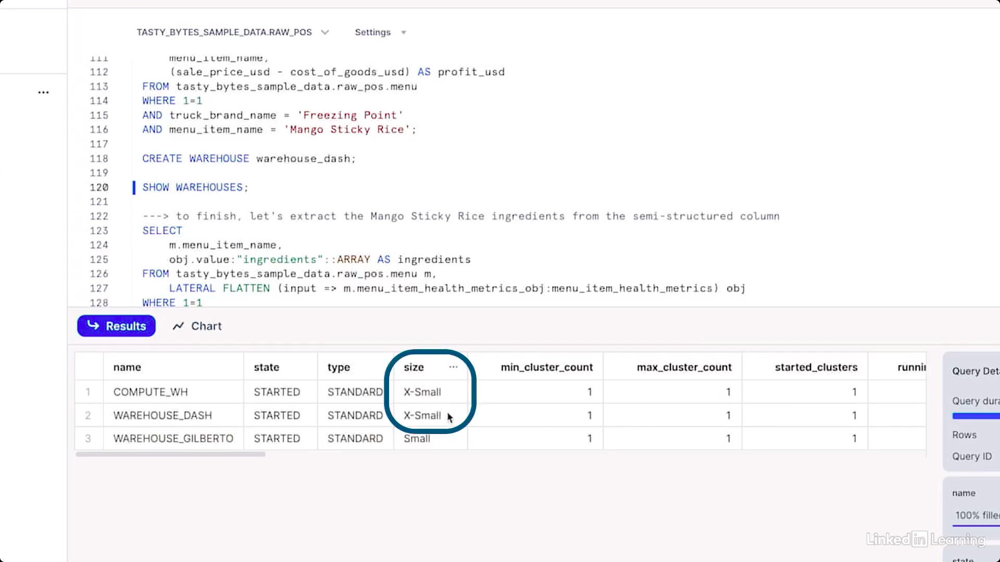

> [!NOTE]
> Note that the new _dash warehouse is extra small. That's because we didn't specify the size when we created it, so it defaulted to extra small.

3. Before, we switched from Compute Warehouse to Warehouse Gilberto using the UI by clicking on the top right and making the switch there. But we can also switch it by writing a command. All we have to do is type use warehouse, followed by the name of the warehouse. So let's switch from warehouse_dash back to warehouse_gilberto.

Query:

```sql
USE WAREHOUSE warehouse_gilberto;
```
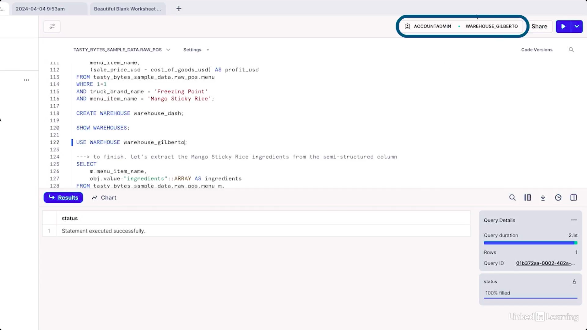

*That was productive. We learned what virtual warehouses are, how to create them, how to see all of them at once, and how to switch between them. Coming up, we'll learn about scaling virtual warehouses.*

## Virtual warehouses scaling: Part 1

With a single line of code, you can scale up a virtual warehouse. This means you're temporarily laying claim to dramatically more compute resources from the Snowflake compute pool. Then with another line of code, you can scale back down all within a single workflow. Being able to scale up and down like this is really useful because this makes you much more efficient. 

You don't need to use vast compute resources for small jobs just because at one point in your workflow you'll require massive compute to  analyze a huge table.

### Example

```text
If we're working with a Tasty Bytes menu table, which is only a hundred rows, we don't need a large machine, but then we might need to query the orders table, which has more than 600 million rows. Scaling up and scaling down saves the day, so we're not trying to run a huge job through a small machine, which would take a long time. Or wastefully run a small job on a large machine.
```

*So here's what you need to know about scaling warehouses.*

There are currently 10 standard warehouse sizes:

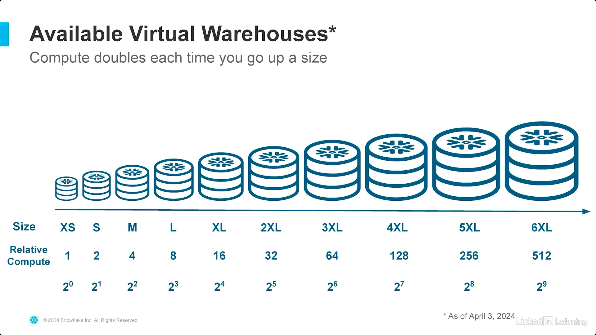


The amount of compute you're accessing doubles each time you go up a size, as does the number of credits you use per hour. So you can keep an extra small running for an hour and only use one credit, two to the zeroth power. But a six XL would use 512 credits in an hour, two to the ninth power.

> [!NOTE]
> We won't be discussing this idea more in this course, but there are times when scaling to a huge number of machines for a short time can actually save you credits, relative to running a compute intensive task on a smaller number of machines for a longer time, or at the very least, there are lots of moments when scaling up can save you time at equivalent cost.

To do it through the UI, follow the below steps:

- Go back to your list of warehouses under the admin tab.
- Click on the three dots, on the right hand side of the screen.
- Select "edit," and then select your desired size from the dropdown.

But usually you're probably not going to want to do this through the UI if you're trying to scale up and down within a given workflow. So instead, you'll want to go to your worksheet and use an alter warehouse command like this.

1. You type "alter warehouse," followed by the warehouse name, followed by warehouse size equals, and then the desired warehouse size.

Query:

```sql
ALTER WAREHOUSE warehouse_dash SET warehouse_size=MEDIUM;
```

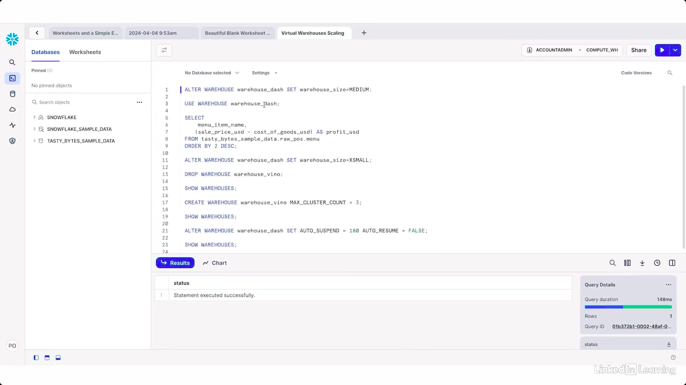

2. Now let's sort the menu items by how much profit we get per item when we sell it. 

Query:

```sql
SELECT
    menu_item_name,
    (sale_price_usd - cost_of_goods_usd) as profit_usd
FROM tasty_bytes_sample_data.raw_pos.menu
ORDER BY 2 DESC;
```
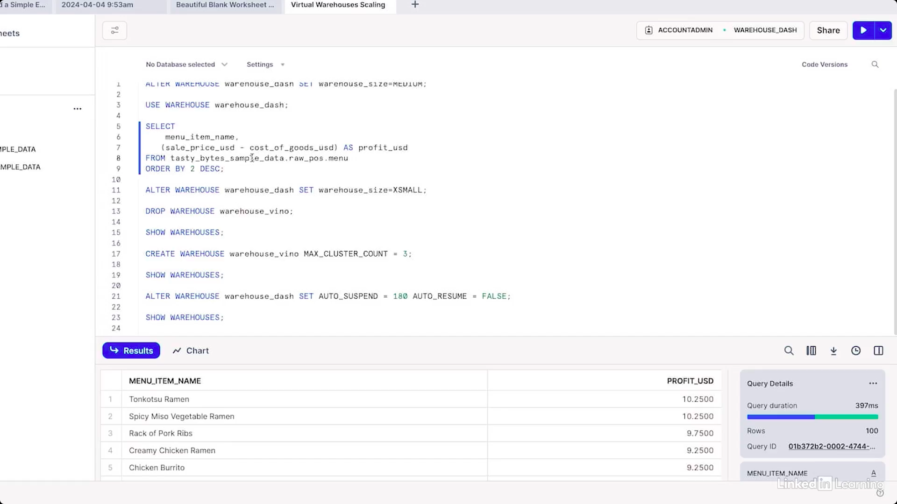

Cool, selling a unit of Tonkatsu Ramen yields a profit of over $10. 

3. Now let's scale the warehouse down again.

Query:

```sql
ALTER WAREHOUSE warehouse_dash SET warehouse_size=XSMALL;
```

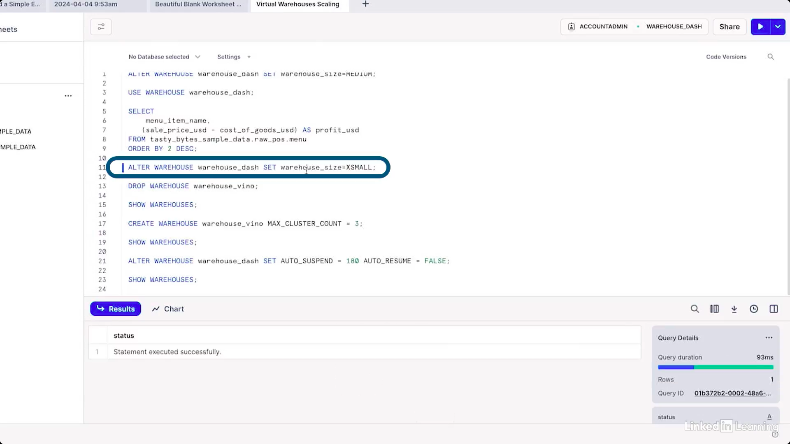

> [!NOTE]
> In this case, we're dealing with a tiny dataset, so the scaling up was not particularly helpful. But in the next video, we'll deal with the sufficiently compute heavy data ingestion process that it will really save us time to scale up.

*In this section of the doc we learned about scaling vertically. In particular, we talked about the compute power and credit consumption of different warehouse sizes, and we learned how to resize a warehouse with the UI and the alter warehouse command with set warehouse size. Coming up, we'll pick up right where we left off and learn about scaling horizontally.*

## Virtual warehouses scaling: Part 2

We're going to get right back into it by talking about a different form of scaling. Scaling horizontally. So by default, a virtual warehouse consists of a single cluster of compute resources, and when you submit queries to the warehouse, the warehouse allocates resources to each query and begins executing the queries.

If there aren't enough resources to execute all the queries, Snowflake starts queuing the queries and you just have to wait for all of them to get handled sequentially.

Example:

```text
Imagine there are three data engineers working with Tasty Bytes data at the same time, one submits a query that occupies the resources of the data warehouse. Then the second uses that same warehouse and has to wait for the first to finish. Then the third runs a query and is behind both of the others in line. 
```

In a case like this where users are running a bunch of concurrent queries, instead of doing what we did earlier in scaling our cluster vertically by selecting a larger warehouse, we probably want to scale horizontally, so make use of more clusters.

*So let's go ahead and set up a multi cluster warehouse to see what that's all about.*

1. Let's use the UI to make a new warehouse that's multi cluster from the get go. Let's name our warehouse, warehouse_vino after another one of my colleagues. But this time let's toggle open the advanced options dropdown.

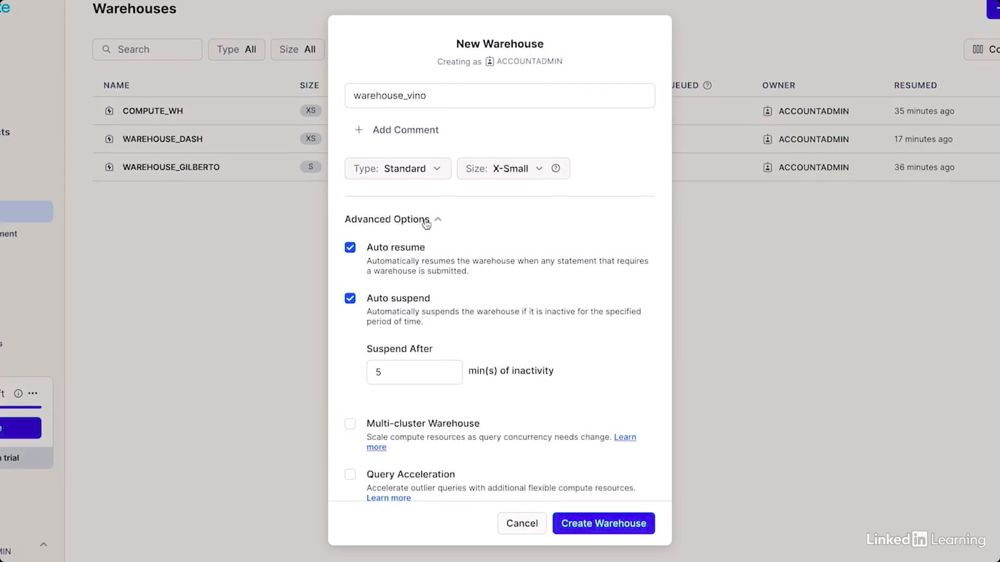

*We'll talk about auto resume and auto suspend in a moment. So let's skip those and instead toggle on multi cluster warehouse.*

2. Let's set the minimum number of clusters as 1 and the max as 3. 

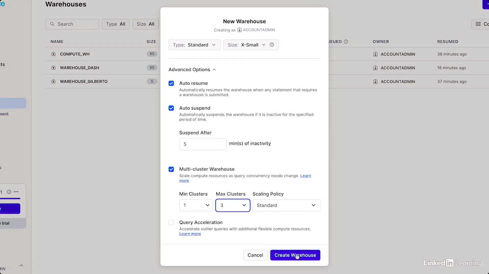

*This means that we'll use one cluster until queries start queuing up until there's a backlog, and then we'll temporarily move to two clusters, and then if that proves insufficient, we'll temporarily move to three clusters.*

3. We make that warehouse and look, under the clusters column, you can see that there are three bars. Pretty neat. 

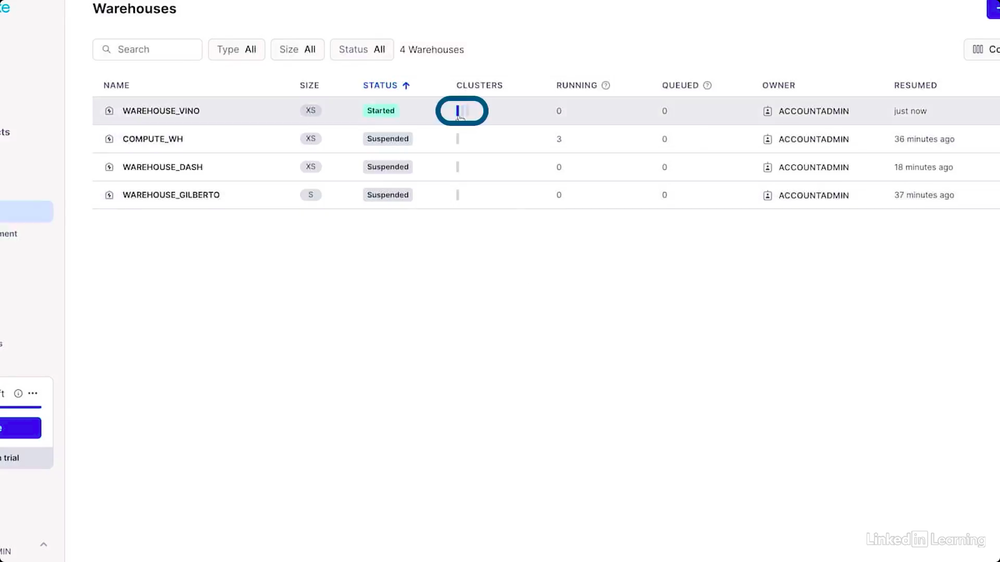

*You won't be surprised to learn that we can also make a multi cluster warehouse through code.Let's do that quickly by hopping over to projects, worksheets, and clicking on our virtual warehouses scaling worksheet.*

4. Let's first drop our warehouse_vino by running the drop warehouse command, followed by the name of the warehouse we want to drop.

Query:

```sql
DROP WAREHOUSE warehouse_vino;
```

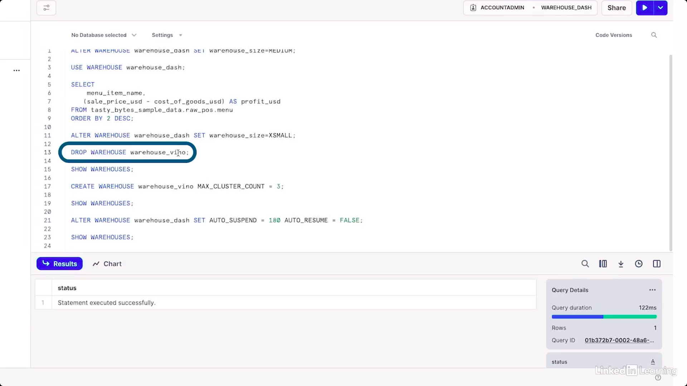

5. Check that the warehouse is really gone using show warehouses.

Query:

```sql
SHOW WAREHOUSES;
```

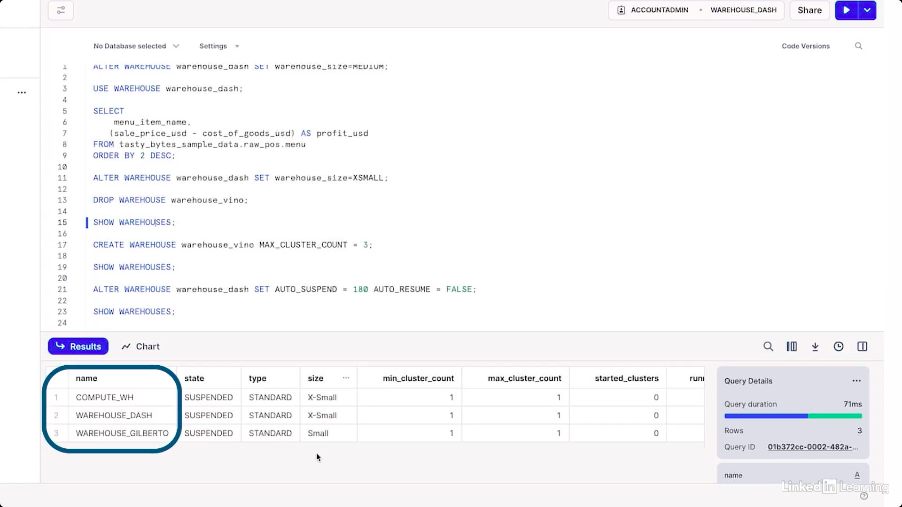

*Yep, no more warehouse_vino.*

6. Type create warehouse, followed by the warehouse name, warehouse_vino, and then we add on the property, max cluster count equals 3. Let's run that and then show our warehouses.

Query:

```sql
CREATE WAREHOUSE warehouse_vino MAX_CLUSTER_COUNT = 3;
SHOW WAREHOUSES;
```

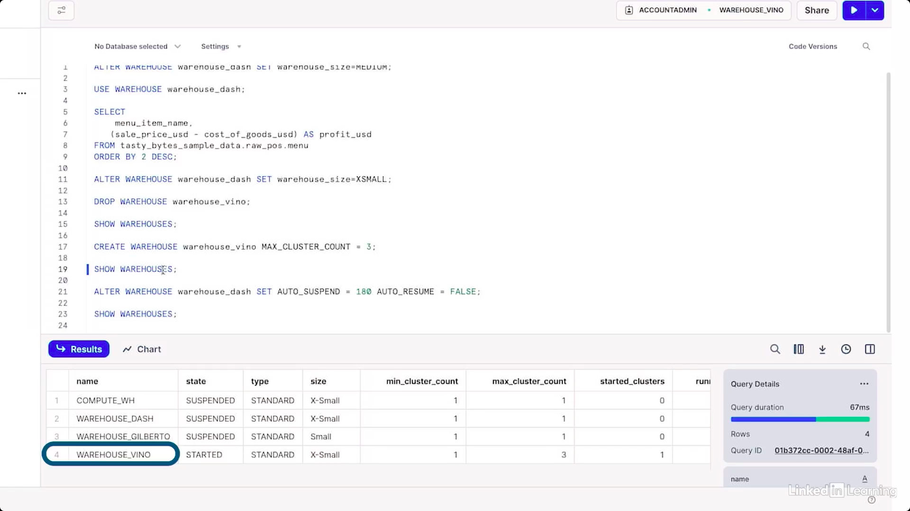

*And sure enough, we have a warehouse_vino multi cluster warehouse once more. And one last word on multi cluster warehouses, you could do the same things with a multi cluster warehouse that you can with a single cluster warehouse like resizing the warehouse, et cetera.* 

Okay, now let's explore two options we skipped a moment ago. Auto resume and auto suspend.

7. Let's hop back to admin and take a look at the warehouses tab. Let's edit the warehouse, Gilberto Warehouse by clicking on the three dots on the right and clicking edit, you'll see that auto resume and auto suspend are both toggled on by default.

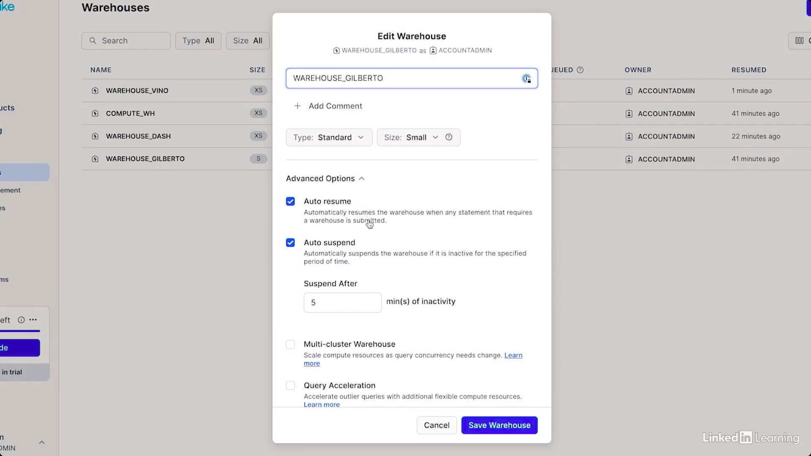

- Auto resume means that the warehouse will automatically kick into action when someone asks it to do something.

- Auto suspend means that after a specified number of minutes of inactivity, the warehouse will turn off.

*My sense is most people keep auto resume on, but you could imagine turning that off for greater control over costs. And my sense is most people keep auto suspend on as a cost saving measure, but they might adjust the number of minutes after which a warehouse shuts down.*

> [!NOTE]
> When you keep your warehouse running, you keep data in cache. So there are queries you might re-execute but not have to really rerun because the results are still there. If you shut off your warehouse too early, you risk having to redo computations because you cleared your cache. So there's a balance here, and what's best for you will depend on your workload.

8. let's hop over to our SQL worksheet and adjust the warehouse-warehouse so that it auto suspends after three minutes and does not auto resume. All we have to do is run an alter warehouse command.

Query:

```sql
ALTER WAREHOUSE ware_house SET AUTO_SUSPEND = 180 AUTO_RESUME = FALSE;
```

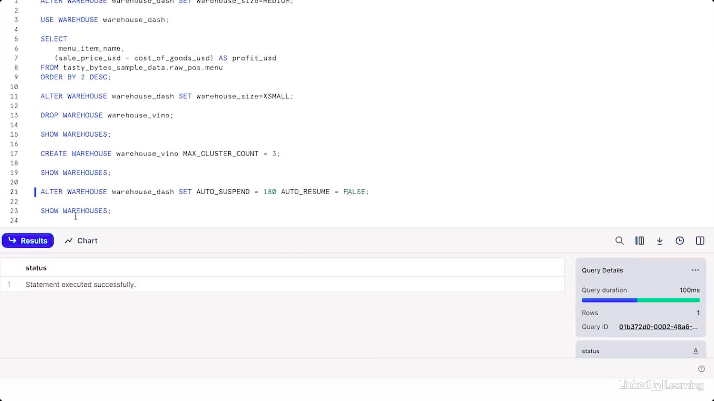

9. Then after we execute that, we can run show warehouse and scroll over to confirm that warehouse dash does indeed auto suspend after 180 seconds and has auto resume set to false.

Query:

```sql
SHOW WAREHOUSES;
```
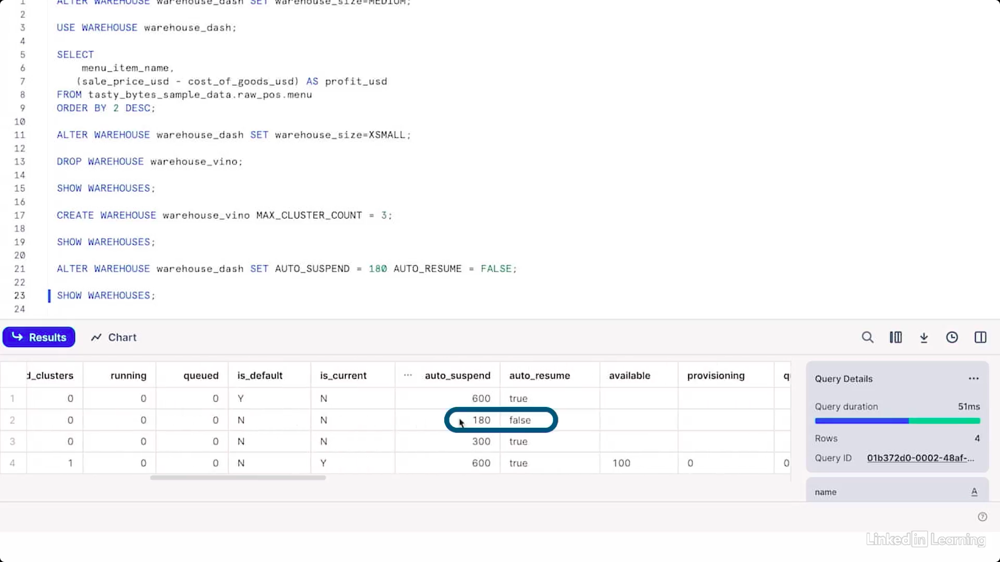

*Sometimes you just want to suspend your warehouse to save credits.*

10. You can do this in the UI by clicking on the three dots and clicking suspend.

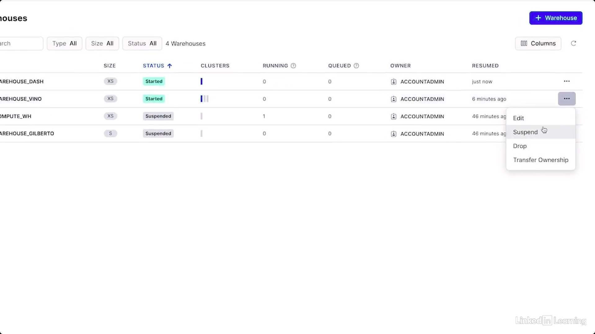

11. Or you can also type alter warehouse, followed by the name of the warehouse, and then suspend. Run that and your warehouse is now suspended.

Query:

```sql
ALTER WAREHOUSE warehouse_dash SUSPEND;
SHOW WAREHOUSES;
```
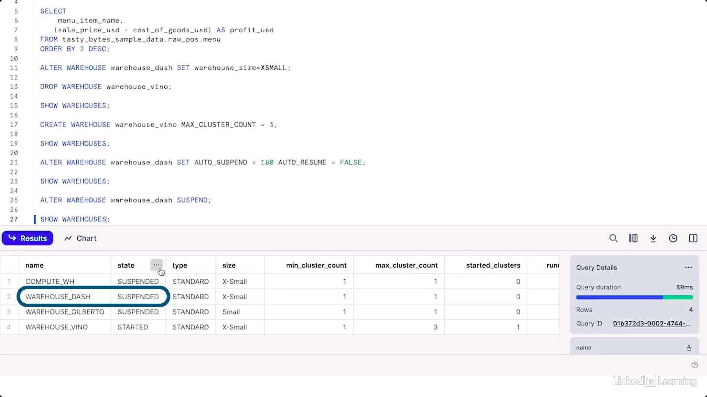

*Let's recap what we've learned about scaling virtual warehouses. We learned what it means to scale a warehouse horizontally and vertically, how to do that and how that translates into credit consumption. We also learned about the auto suspend and auto resume properties and how to manually suspend a warehouse. After some practice, we can now put our warehouse skills to use to ingest some pretty awesome data.*

---

<div align="center">

<h2>✦ Thank You For Reading This Guide ✦</h2>

> *May your pipelines never break and your queries always run fast.* 🚀

</div>