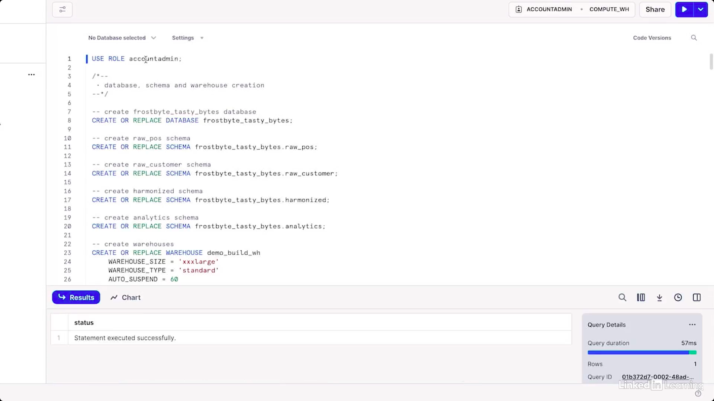
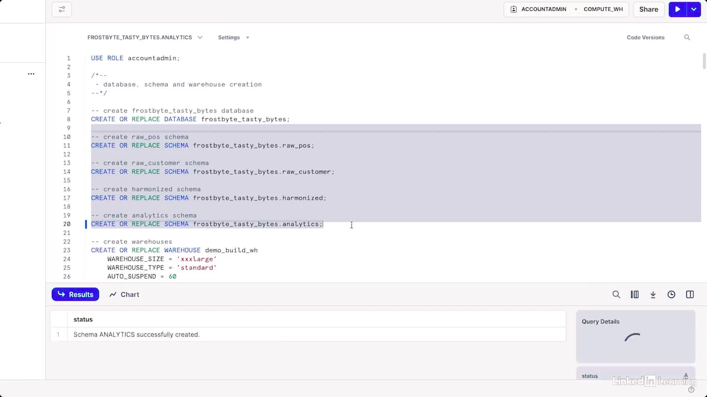
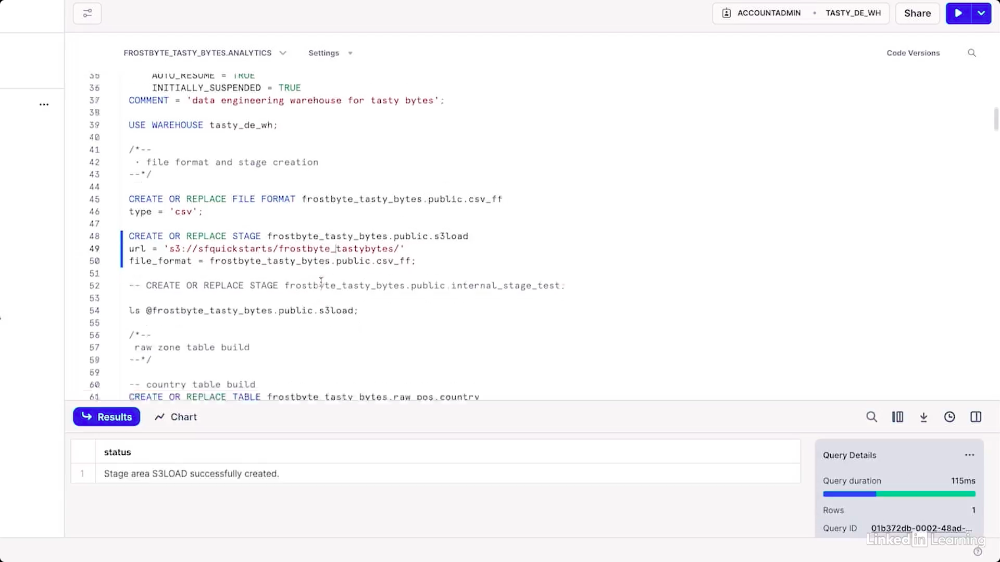
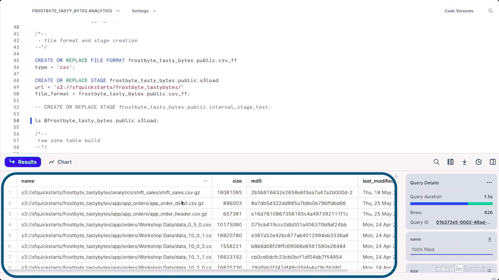
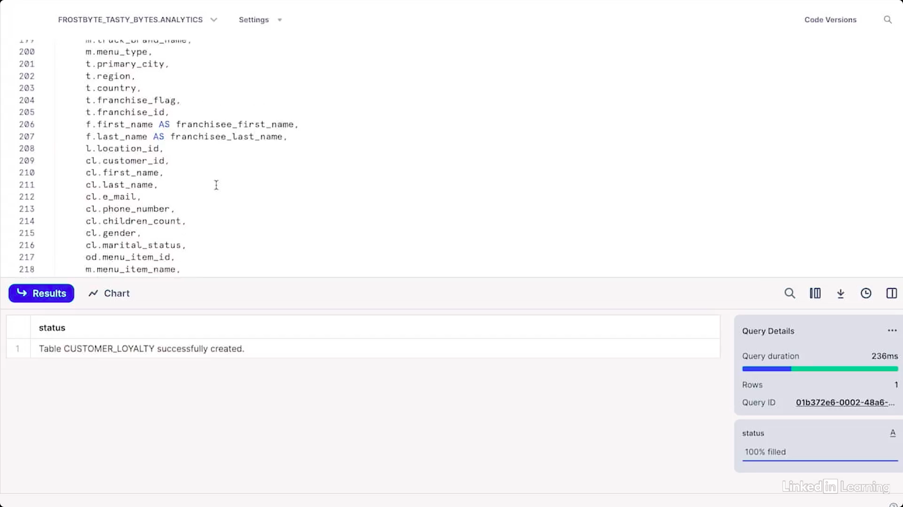
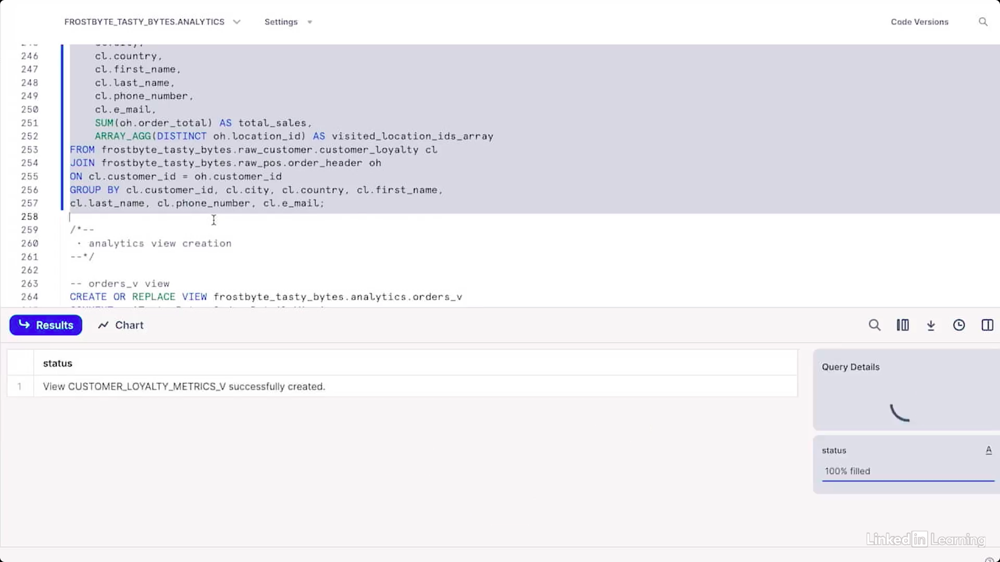
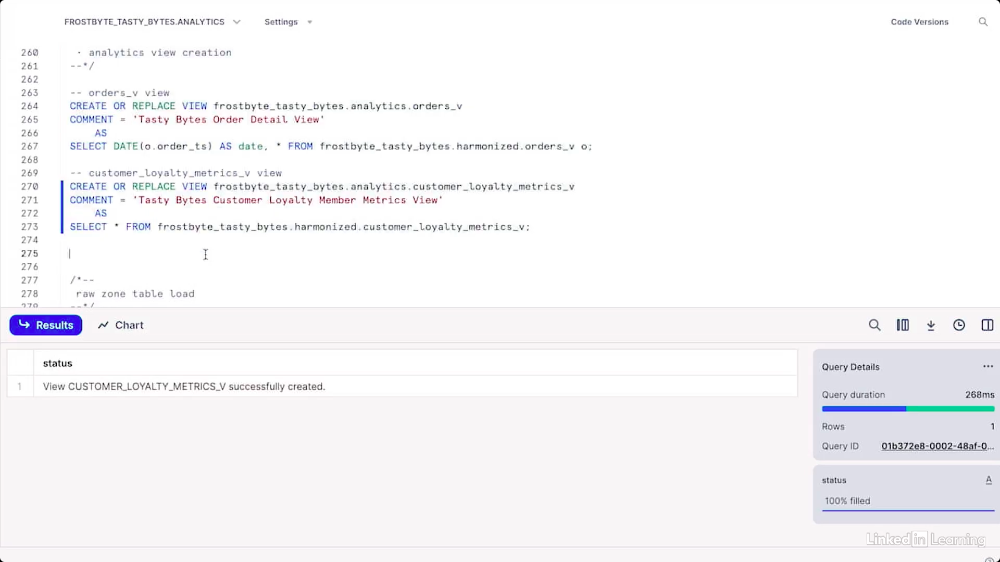
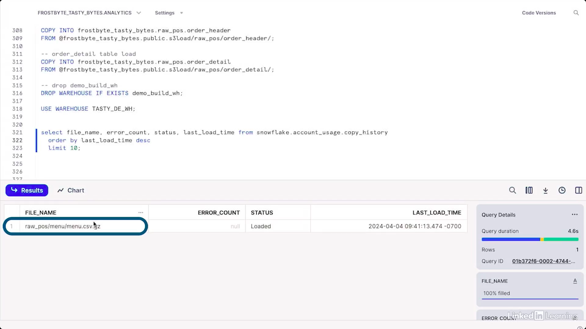
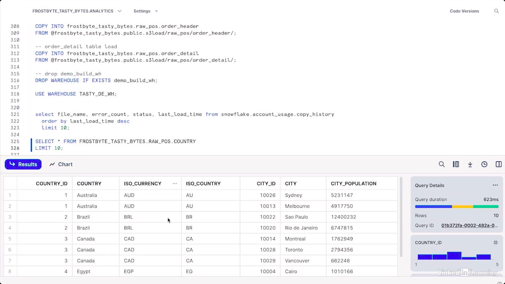

# Stages & Basic Ingestion

We now know a bunch about virtual warehouses, so let's put our knowledge to use to ingest some data. If you have data that you want to load to a table in Snowflake, you do that by way of an intermediate object called a stage. 

- Data on your local machine, you first create a stage object. 
- Data on external cloud storage, you'll first create a stage object. 
- Only after making the stage object do you copy the data to a table. 

The stage serves as a bridge between your data source and your table.

*In this course, we're not going to get into why stages exist. We're just going to learn how to use them. Earlier, we played around with menu data from Tasty Bytes, the food truck company.* 

## Stages & basic ingestion: Part 1

Now we're going to ingest a lot more Tasty Bytes data. Order data, customer data, truck data and more, and we'll use that again and again throughout the course.

1. Okay, so in this worksheet, I'll start by making sure I'm using the super powerful role of account admin.

Query:

```sql
USE ROLE accountadmin;
```


*We won't talk about roles until later in the course, but for now you should know that what I'm doing here is not a best practice. You don't typically just casually use the all powerful account admin role, but in this course we're not going to worry about it, especially not before we cover roles.*

2. Next, I'll create a database and a few different schemas.

Query:

```sql
-- create raw_pos schema
CREATE OR REPLACE SCHEMA frostbyte_tasty_bytes.raw_pos;
-- create raw_customer schema
CREATE OR REPLACE SCHEMA frostbyte_tasty_bytes.raw_customer;
-- create harmonized schema
CREATE OR REPLACE SCHEMA frostbyte_tasty_bytes.harmonized;
-- create analytics schema
CREATE OR REPLACE SCHEMA frostbyte_tasty_bytes.analytics;
```



*We'll talk about databases and schemas in the next video. The one thing I'll point out is that we have two raw schemas and then a cleaned up schema called harmonized.  And finally, our tippity top schema called analytics.*

3. Next, we'll create two warehouses, one just for loading our data and one for doing some analysis work later.

Query:

```sql
-- create warehouses

CREATE OR REPLACE WAREHOUSE demo_build_wh
    WAREHOUSE_SIZE = 'xxxlarge'
    WAREHOUSE_TYPE = 'standard'
    AUTO_SUSPEND = 60
    AUTO_RESUME = TRUE
    INITIALLY_SUSPENDED = TRUE
COMMENT = 'demo build warehouse for frostbyte assets';

CREATE OR REPLACE WAREHOUSE tasty_de_wh
    WAREHOUSE_SIZE = 'xsmall'
    WAREHOUSE_TYPE = 'standard'
    AUTO_SUSPEND = TRUE
    INITIALLY_SUSPENDED = TRUE
COMMENT = 'data engineering warehouse for tasty bytes';
```


> [!NOTE]
> Note that the demo build warehouse that we're using to load our data is a triple XL. Whenever you use a triple XL warehouse, you should tremble a little bit because it's really powerful. That's 64 times as powerful as our standard extra small warehouse and burns 64 times the credits per hour. 

*It's like a giant laser cannon. Super powerful, but also a big responsibility.* 

4. Here we'll use it very briefly to load the Tasty Bytes data from an S3 bucket, and then we'll drop it and never use it again. Then we create a very simple CSV file format. Don't worry about this, it's not critical at the moment. And finally, we get to the focus of this doc creating our stage. Let's run this and talk about what we did.

Query:

```sql
USE WAREHOUSE tasty_de_wh;

CREATE OR REPLACE STAGE frostbyte_tasty_bytes.public.csv_ff
type = 'csv';

CREATE OR REPLACE STAGE frostbyte_tasty_bytes.public.s3load
url = 's3://sfquickstarts/frostbyte_tastybytes/'
file_format = frostbyte_tasty_bytes.public.csv_ff;
```



So there are two kinds of stages, external and internal. Here we've got an external stage, and we can tell because you can see it's pulling from an S3 bucket. 

- `External Stages`: The key thing to know about external stages is the data they're connected to is not managed by Snowflake. This means Snowflake isn't responsible for controlling access to that data. You don't get billed through Snowflake for the storage of that data. This means that when creating an external stage, we'll always add a reference to an external cloud data storage location, AWS S3 or storage in Google Cloud or Azure, plus credentials for accessing that bucket if necessary. 

    ```sql
    CREATE OR REPLACE STAGE frostbyte_tasty_bytes.public.s3load
    url = 's3://sfquickstarts/frostbyte_tastybytes/'
    file_format = frostbyte_tasty_bytes.public.csv_ff;
    ```
    Here, credentials weren't necessary. If you don't see a URL referencing external storage, then it's not an external stage.

- `Internal Stage`: Internal stages are different. Snowflake does manage the cloud storage for internal stages, and that means Snowflake takes care of security. Snowflake manages the associated cloud storage billing. So if you saw a stage creation command that didn't have a reference to an external cloud data source, you'd know it's internal. It would look something like this. 

    ```sql
    CREATE OR REPLACE STAGE frostbyte_tasty_bytes.public.internal_stage_test;
    ```

    No URL, no access credentials.

We're not really going to cover file formats in this course. I'll just mention that they give Snowflake information about the kind of file you're about to ingest. But I do want to note that you can use file formats with both internal and external stages, even though we're only seeing it next to the external stage here.

*To recap, in this part of the doc, we explain what a Snowflake stage object is. We created an external stage and uploaded files to it using the create stage command, and we explain the difference between an external and internal stage. Next, we'll learn about the three different kinds of internal stages, and then we'll actually load files from a stage into an existing table.*

## Stages & basic ingestion: Part 2

It's funny how different this doc would be if we were about to talk about stages and basic ingestion. Anyway, let's get back into it, and learn about the different kinds of internal stages.

There are three flavors of internal stage

- `User Stage`: Every user has a user stage that only that user can access, but from which you can copy data into multiple tables. You can't drop the user stage.

- `Table Stage`: Every table has a table stage that can only be used with that table, and again, you can't drop it.

- `Named Stage`: Name stages can be used by multiple users and be associated with multiple tables.

You'll be mostly using name stages because of their flexibility.

*We're not going to create an internal stage here, but a key thing to know is that once you've created your internal stage, you need to take another step to actually move data from your local computer to that stage by using a put command for example.*

1. Okay, let's turn our attention back to our external stage and list all of the stages files by running ls, which is short for list, followed by @, and the name of the stage. 

Query:

```sql
ls @frostbyte_tasty_bytes.public.s3load;
```



These are the files we want to ingest

> [!NOTE]
> When referencing name stages in our code, we use the @ character. When referencing table stages, we use @ followed by the % character. And when referencing user stages, we use @ followed by a ~. 

*Okay, so let's keep going. We've now made our external stage, but we haven't yet used the stage as a bridge to help us copy data from our S3 bucket.*

2. To do that, we first need to make some empty tables to hold the raw data.

```sql
-- country table build
CREATE OR REPLACE TABLE tasty_bytes.raw_pos.country
(
    country_id NUMBER(18,0),
    country VARCHAR(16777216),
    iso_currency VARCHAR(3),
    iso_country VARCHAR(2),
    city_id NUMBER(19,0),
    city VARCHAR(16777216),
    city_population VARCHAR(16777216)
);
-- franchise table build
CREATE OR REPLACE TABLE tasty_bytes.raw_pos.franchise
(
    franchise_id NUMBER(38,0),
    first_name VARCHAR(16777216),
    last_name VARCHAR(16777216),
    city VARCHAR(16777216),
    country VARCHAR(16777216),
    e_mail VARCHAR(16777216),
    phone_number VARCHAR(16777216)
);
-- location table build
CREATE OR REPLACE TABLE tasty_bytes.raw_pos.location
(
    location_id NUMBER(19,0),
    placekey VARCHAR(16777216),
    location VARCHAR(16777216),
    city VARCHAR(16777216),
    region VARCHAR(16777216),
    iso_country_code VARCHAR(16777216),
    country VARCHAR(16777216)
);
-- menu table build
CREATE OR REPLACE TABLE tasty_bytes.raw_pos.menu
(
    menu_id NUMBER(19,0),
    menu_type_id NUMBER(38,0),
    menu_type VARCHAR(16777216),
    truck_brand_name VARCHAR(16777216),
    menu_item_id NUMBER(38,0),
    menu_item_name VARCHAR(16777216),
    item_category VARCHAR(16777216),
    item_subcategory VARCHAR(16777216),
    cost_of_goods_usd NUMBER(38,4),
    sale_price_usd NUMBER(38,4),
    menu_item_health_metrics_obj VARIANT
);
-- truck table build
CREATE OR REPLACE TABLE tasty_bytes.raw_pos.truck
(
    truck_id NUMBER(38,0),
    menu_type_id NUMBER(38,0),
    primary_city VARCHAR(16777216),
    region VARCHAR(16777216),
    iso_region VARCHAR(16777216),
    country VARCHAR(16777216),
    iso_country_code VARCHAR(16777216),
    franchise_flag NUMBER(38,0),
    year NUMBER(38,0),
    make VARCHAR(16777216),
    model VARCHAR(16777216),
    ev_flag NUMBER(38,0),
    franchise_id NUMBER(38,0),
    truck_opening_date DATE
);
-- order_header table build
CREATE OR REPLACE TABLE tasty_bytes.raw_pos.order_header
(
    order_id NUMBER(38,0),
    truck_id NUMBER(38,0),
    location_id FLOAT,
    customer_id NUMBER(38,0),
    discount_id VARCHAR(16777216),
    shift_id NUMBER(38,0),
    shift_start_time TIME(9),
    shift_end_time TIME(9),
    order_channel VARCHAR(16777216),
    order_ts TIMESTAMP_NTZ(9),
    served_ts VARCHAR(16777216),
    order_currency VARCHAR(3),
    order_amount NUMBER(38,4),
    order_tax_amount VARCHAR(16777216),
    order_discount_amount VARCHAR(16777216),
    order_total NUMBER(38,4)
);
-- order_detail table build
CREATE OR REPLACE TABLE tasty_bytes.raw_pos.order_detail
(
    order_detail_id NUMBER(38,0),
    order_id NUMBER(38,0),
    menu_item_id NUMBER(38,0),
    discount_id VARCHAR(16777216),
    line_number NUMBER(38,0),
    quantity NUMBER(5,0),
    unit_price NUMBER(38,4),
    price NUMBER(38,4),
    order_item_discount_amount VARCHAR(16777216)
);
-- customer loyalty table build
CREATE OR REPLACE TABLE tasty_bytes.raw_customer.customer_loyalty
(
    customer_id NUMBER(38,0),
    first_name VARCHAR(16777216),
    last_name VARCHAR(16777216),
    city VARCHAR(16777216),
    country VARCHAR(16777216),
    postal_code VARCHAR(16777216),
    preferred_language VARCHAR(16777216),
    gender VARCHAR(16777216),
    favourite_brand VARCHAR(16777216),
    marital_status VARCHAR(16777216),
    children_count VARCHAR(16777216),
    sign_up_date DATE,
    birthday_date DATE,
    e_mail VARCHAR(16777216),
    phone_number VARCHAR(16777216)
);
```



*There's a country table, and a franchise table, and many others. Location, menu, truck, orders, customers.*

3. Then we'll create two views that join together a bunch of these tables and store the results in the harmonized schema. 

Query:

```sql
/*--
harmonized view creation
--*/
-- orders_v view
CREATE OR REPLACE VIEW tasty_bytes.harmonized.orders_v
AS
SELECT
    oh.order_id,
    oh.truck_id,
    oh.order_ts,
    od.order_detail_id,
    od.line_number,
    m.truck_brand_name,
    m.menu_type,
    t.primary_city,
    t.region,
    t.country,
    t.franchise_flag,
    t.franchise_id,
    f.first_name AS franchisee_first_name,
    f.last_name AS franchisee_last_name,
    l.location_id,
    cl.customer_id,
    cl.first_name,
    cl.last_name,
    cl.e_mail,
    cl.phone_number,
    cl.children_count,
    cl.gender,
    cl.marital_status,
    od.menu_item_id,
    m.menu_item_name,
    od.quantity,
    od.unit_price,
    od.price,
    oh.order_amount,
    oh.order_tax_amount,
    oh.order_discount_amount,
    oh.order_total
FROM tasty_bytes.raw_pos.order_detail od
JOIN tasty_bytes.raw_pos.order_header oh
    ON od.order_id = oh.order_id
JOIN tasty_bytes.raw_pos.truck t
    ON oh.truck_id = t.truck_id
JOIN tasty_bytes.raw_pos.menu m
    ON od.menu_item_id = m.menu_item_id
JOIN tasty_bytes.raw_pos.franchise f
    ON t.franchise_id = f.franchise_id
JOIN tasty_bytes.raw_pos.location l
    ON oh.location_id = l.location_id
LEFT JOIN tasty_bytes.raw_customer.customer_loyalty cl
    ON oh.customer_id = cl.customer_id;

-- loyalty_metrics_v view
CREATE OR REPLACE VIEW tasty_bytes.harmonized.customer_loyalty_metrics_v
AS
SELECT
    cl.customer_id,
    cl.city,
    cl.country,
    cl.first_name,
    cl.last_name,
    cl.phone_number,
    cl.e_mail,
    SUM(oh.order_total) AS total_sales,
ARRAY_AGG(DISTINCT oh.location_id) AS visited_location_ids_array
FROM tasty_bytes.raw_customer.customer_loyalty cl
JOIN tasty_bytes.raw_pos.order_header oh
    ON cl.customer_id = oh.customer_id
GROUP BY 
    cl.customer_id, cl.city, cl.country, cl.first_name, cl.last_name, cl.phone_number, cl.e_mail;
```



And don't worry about what a view is, we'll talk about them in a future doc. 

4. And then we create a view for the highly cleaned, highly reliable analytics schema.

Query:

```sql
/*--
analytics view creation
--*/
-- orders_v view
CREATE OR REPLACE VIEW tasty_bytes.analytics.orders_v
COMMENT = 'Tasty Bytes Order Detail View'
AS
SELECT DATE(o.order_ts) AS date, * FROM tasty_bytes.harmonized.orders_v o;
-- customer_loyalty_metrics_v view
CREATE OR REPLACE VIEW tasty_bytes.analytics.customer_loyalty_metrics_v
COMMENT = 'Tasty Bytes Customer Loyalty Member Metrics View'
AS
SELECT * FROM tasty_bytes.harmonized.customer_loyalty_metrics_v;
```



*Awesome, now it's finally time to spin up our super powerful 3XL laser canon of a data warehouse, demo build warehouse, and actually copy the data from our external storage to our tables using our stage.*

5. Assuming we've set up our table with the right number of fields and the right data types, this is very easy. All we need to do is use the command copy into, followed by the name of the destination table and then from followed by at and the stage name. We'll run this whole section at once, including the command to drop the demo build warehouse once we're done with it.

Query:

```sql
/*--
raw zone table load
--*/
USE WAREHOUSE demo_build_wh;

-- country table load
COPY INTO tasty_bytes.raw_pos.country
FROM @tasty_bytes.public.s3load/raw_pos/country/;
-- franchise table load
COPY INTO tasty_bytes.raw_pos.franchise
FROM @tasty_bytes.public.s3load/raw_pos/franchise/;
-- location table load
COPY INTO tasty_bytes.raw_pos.location
FROM @tasty_bytes.public.s3load/raw_pos/location/;
-- menu table load
COPY INTO tasty_bytes.raw_pos.menu
FROM @tasty_bytes.public.s3load/raw_pos/menu/;
-- truck table load
COPY INTO tasty_bytes.raw_pos.truck
FROM @tasty_bytes.public.s3load/raw_pos/truck/;
-- customer_loyalty table load
COPY INTO tasty_bytes.raw_customer.customer_loyalty
FROM @tasty_bytes.public.s3load/raw_customer/customer_loyalty/;
-- order_header table load
COPY INTO tasty_bytes.raw_pos.order_header
FROM @tasty_bytes.public.s3load/raw_pos/subset_order_header/;
-- order_detail table load
COPY INTO tasty_bytes.raw_pos.order_detail
FROM @tasty_bytes.public.s3load/raw_pos/subset_order_detail/;

DROP WAREHOUSE demo_build_wh;
```

*If this hadn't worked, we'd have seen some errors, but if we're willing to wait a while up to an hour or two and we wanted to double check, we could use one of Snowflake's built-in observability features.*

6. We just query the copy history view within the account usage schema within the Snowflake database, like this. Select file name error account from Snowflake dot account usage dot copy history. We can pick a few fields we're interested in. Here, I've picked filename, error count, status, and last load time. And check the 10 files that were loaded most recently.

Query:

```sql
SELECT 
    file_name,
    error_count,
    status,
    last_load_time,
FROM snowflake.account_usage.copy_history
ORDER BY last_load_time DESC
LIMIT 10;
```



*In this case, all we're seeing is the Tasty Bytes sample data menu table that we loaded in a previous video because there's some latency, but if we came back later and ran this again, we'd see the order detail files we just loaded.*

7. To confirm more quickly that our table's loaded properly, we can just go to left hand database dropdown and find a table, say country and query it.

Query:

```sql
SELECT * FROM FROSTBYTE_TASTY_BYTES.RAW_POS.COUNTRY
LIMIT 10;
```



Looks like at least that table loaded successfully. (graphics whooshing) So there you have it. We covered parts 1 and 2 of stages and basic ingestion, and as far as I could tell, there's no ingestion in sight.

Here's a quick recap of the seven things we covered. 

- We learned about what a Snowflake stage object is. 
- We learned how to create an external stage and upload files to it using the create stage command. 
- We learned how to explain the difference between an external stage and an internal stage. Remember if there's a reference to a cloud storage bucket, it's an external stage. 
- We learned about the three types of internal stages, user. table, and named. 
- We learned how to view staged files using the list command. 
- We learned you can load files from a stage to an existing table using the copy into command. 
- We learned that you can query Snowflake data loading history with the copy history view in the account usage schema.

*You've successfully conquered this stage. Soon we'll learn about databases, schemas, tables, and views.*

---

<div align="center">

<h2>✦ Thank You For Reading This Guide ✦</h2>

> *May your pipelines never break and your queries always run fast.* 🚀

</div>